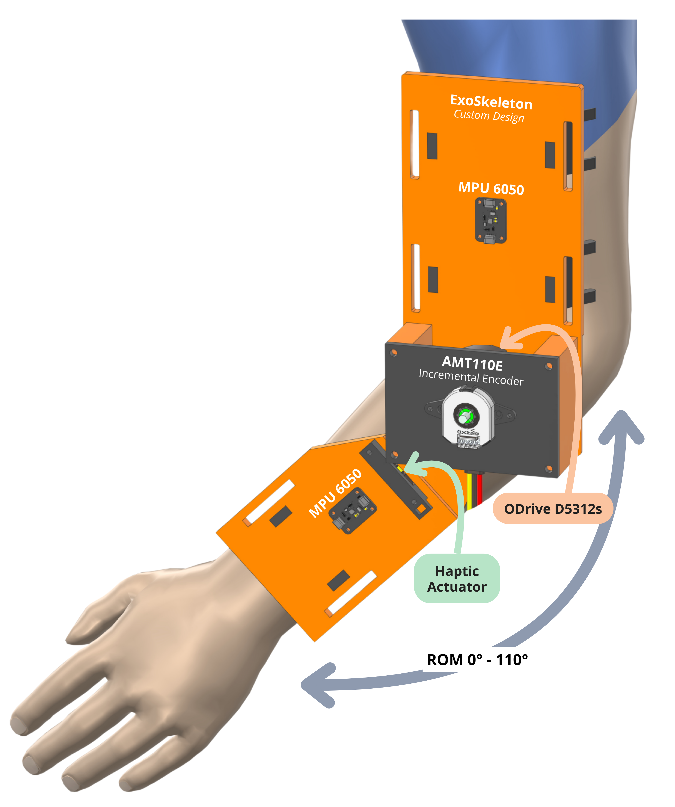
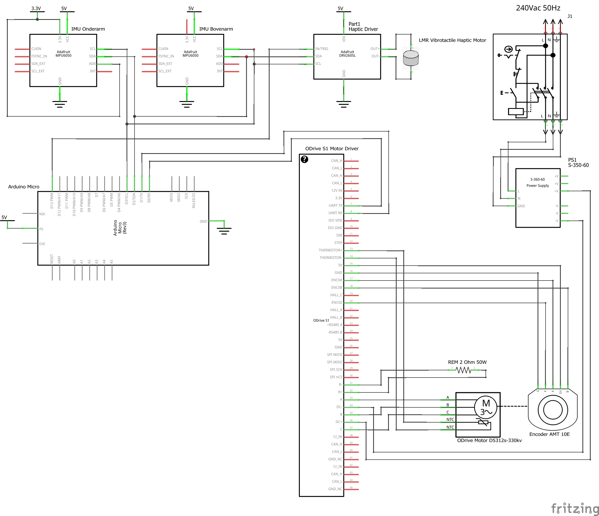
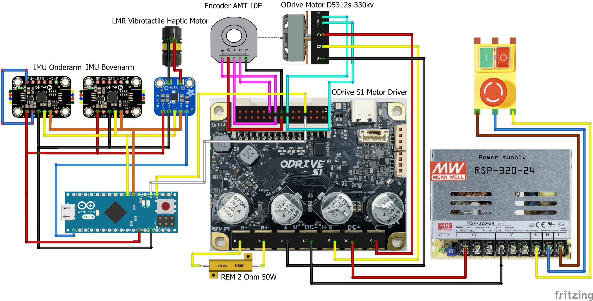
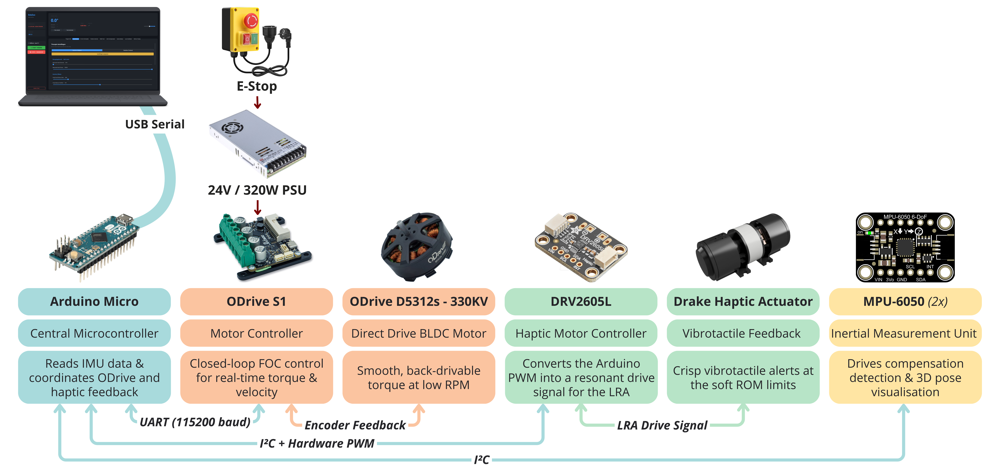

# HapticElbow

**An open-source adaptive elbow exoskeleton for stroke rehabilitation**

*B-KUL-T4lMD2 · Haptic Interfaces Experience*

**Authors:**
Senne Peeters, Niel Boon

**Institution:**
KU Leuven · Group T · Department of Mechanical Engineering

**Date:**
May 2026

---

## Table of contents

1. [Introduction](#1-introduction)
   - [1.1 Why robot-assisted training is needed](#11-why-robot-assisted-training-is-needed)
   - [1.2 Why haptic feedback matters](#12-why-haptic-feedback-matters)
   - [1.3 The compensation problem](#13-the-compensation-problem)
   - [1.4 Existing solutions and the gap we address](#14-existing-solutions-and-the-gap-we-address)
   - [1.5 Project objectives](#15-project-objectives)
2. [Supplies - Bill of materials](#2-supplies---bill-of-materials)
3. [Methods](#3-methods)
   - [3.1 System architecture](#31-system-architecture)
   - [3.2 Why we chose these components](#32-why-we-chose-these-components)
   - [3.3 Mechanical and electrical build](#33-mechanical-and-electrical-build)
   - [3.4 ODrive configuration](#34-odrive-configuration)
   - [3.5 Control logic](#35-control-logic)
   - [3.6 Dual-IMU sensing](#36-dual-imu-sensing)
   - [3.7 Vibrotactile feedback](#37-vibrotactile-feedback)
   - [3.8 Python dashboard](#38-python-dashboard)
   - [3.9 Lessons from troubleshooting](#39-lessons-from-troubleshooting)
4. [Discussion](#4-discussion)
5. [Conclusion and future work](#5-conclusion-and-future-work)
6. [Abbreviations](#6-abbreviations)
7. [References](#7-references)

---

## 1. Introduction

The image below shows our final HapticElbow prototype, an open-source elbow exoskeleton aimed at stroke rehabilitation. You can see the upper-arm cuff that carries the brushless motor and the AMT110 encoder, the forearm cuff with the Drake vibration unit on the inside, and the two MPU-6050 IMU sensors that track the arm's orientation. The rest of this document walks through how each part was chosen and how the firmware, sensors and dashboard work together as one system.



### 1.1 Why robot-assisted training is needed

Stroke is one of the largest causes of long-term motor disability worldwide. The World Health Organization estimates that around 15&nbsp;million people suffer a stroke every year, and roughly one in three survivors is left with permanent impairment [[1]](#7-references). Many of those survivors lose control over the proximal arm, which makes basic daily tasks like reaching, lifting and self-care very difficult.

The good news is that the brain can rewire itself. This is called neuroplasticity. With enough repeated, voluntary, task-specific practice, new connections form and lost function can come back at least partially [[2]](#7-references).

That is the reason robots are useful in rehabilitation. A robot can support thousands of repetitions without getting tired, and a large Cochrane review by Mehrholz and colleagues confirms that robot-assisted arm training, on top of normal therapy, leads to measurable improvements in arm function and daily-living scores [[3]](#7-references). But there is an important condition: the patient has to stay an active participant. Passively dragging the arm through a motion produces almost no benefit. So the modern paradigm in rehabilitation robotics is called **assist-as-needed (AAN)** [[4]](#7-references). The robot should only do as much as the patient needs to complete the motion, and no more.

### 1.2 Why haptic feedback matters

Motor learning depends on feedback. For a rehabilitation device, two kinds of touch-based feedback are relevant:

- **Kinaesthetic feedback** - forces transmitted through the structure of the device. Our system uses a back-drivable brushless motor in current (torque) mode. That means the motor produces a smooth, soft push, and never locks the joint in a stiff position.
- **Vibrotactile feedback** - short skin vibrations that signal events. Vibrations are useful for things like "you have reached the limit" or "good job". Bark and colleagues showed that vibrotactile cues during arm tasks reduce path errors and speed up motor learning, because the patient does not have to look at a screen to receive the information [[5]](#7-references).

### 1.3 The compensation problem

A well-known issue in upper-limb rehabilitation is the **compensation strategy**. When the elbow flexors are too weak, the patient automatically recruits other muscles instead. The shoulder lifts or the trunk rotates, so the forearm *looks* like it bends, but the elbow itself barely contributes [[6]](#7-references).

This is harmful because the brain learns whatever motion is rehearsed. If the patient practises a "fake" reach for hours, the wrong movement pattern becomes more automatic than the right one.

Two inertial measurement units (IMUs) - one on the upper arm and one on the forearm - let us tell a real elbow flexion apart from a shoulder lift. Three findings from the clinical literature shape the algorithm we use (see §3.6.1):

- In a healthy reach, the elbow contributes about 40 to 60&nbsp;% of the total motion. After a stroke, this drops to 10 to 30&nbsp;% [[7]](#7-references).
- The expected balance between shoulder and elbow depends on the *zone* the arm is in. Low down, the shoulder should hardly move at all. High up, the shoulder is at its limit and the elbow has to do everything [[8]](#7-references).
- Only the *outgoing* part of a reach should be scored. The way back to rest is not a compensation [[9]](#7-references).

### 1.4 Existing solutions and the gap we address

There are established robotic platforms for stroke therapy like MIT-Manus, ARMin and the Armeo family. They have strong clinical evidence behind them, but they cost between €50&nbsp;000 and €150&nbsp;000, need a dedicated clinical setup, and are closed-source. There are also cheaper open-source projects, but they usually use stepper motors or geared transmissions that are stiff and not back-drivable.

Our project sits in the gap that none of those cover at once:

- Precise, back-drivable torque control with field-oriented current control.
- Short vibrotactile alerts at the soft range-of-motion limits.
- Real-time compensation detection grounded in the clinical literature.
- One central tare button so every subsystem uses the same arm-orientation reference.
- A gamified patient dashboard with a mirror-therapy visualisation.

All hardware, firmware and software is released openly. The full prototype costs about €540.

### 1.5 Project objectives

- Provide adjustable assistive torque that responds to the patient's own movement, instead of dragging the arm through a fixed trajectory.
- Use two IMUs both for compensation detection and for 3D arm-pose estimation.
- Deliver short, clear vibrotactile alerts at the soft range-of-motion limits.
- Expose every therapy parameter through a real-time dashboard, with gamified training modes.
- Document the design well enough that a third party can rebuild it from this repository.

---

## 2. Supplies - Bill of materials

CAD files for the printed parts are in *`/cad/`* (Siemens NX `.prt` format). **Estimated total prototype cost: approximately €540.**

### 2.1 Actuation and motor control

| Component                              | Description                                                                                              | Source               | Cost (€) |
| -------------------------------------- | -------------------------------------------------------------------------------------------------------- | -------------------- | -------- |
| ODrive S1                              | Single-axis motor controller, 12-50&nbsp;V input, isolated UART.                                         | ODrive Robotics      | 155      |
| BLDC motor (D5312s 330KV)              | Brushless outrunner motor, smooth at low speed, fully back-drivable.                                     | ODrive Robotics      | 85       |
| AMT110 incremental encoder             | Reads the motor angle. Configurable resolution via DIP switches, gives one index pulse per revolution.   | Digi-Key             | 30       |
| Mean Well RSP-320-24 PSU               | 24&nbsp;V / 13.4&nbsp;A enclosed power supply, fits inside the ODrive's 12-50&nbsp;V input range.        | Farnell              | 65       |
| 230&nbsp;V safety switch with E-stop   | Single-phase switch with a red mushroom-button on the mains feed.                                        | Amazon DE            | 25       |

### 2.2 Microcontroller and communication

| Component                              | Description                                                                                              | Source               | Cost (€) |
| -------------------------------------- | -------------------------------------------------------------------------------------------------------- | -------------------- | -------- |
| Arduino Micro (ATmega32U4)             | The microcontroller that runs the firmware.                                                              | Arduino Official     | 25       |
| Micro-USB data cable                   | Serial link between the Arduino and the PC.                                                              | Any                  | 5        |
| Soldered connection board              | Perfboard with all module connections soldered on it. The Arduino sits in pin headers so it stays removable. | Self-built           | 25       |
| Jumper wires                           | Dupont jumpers for the off-board IMU and Drake modules.                                                  | Any                  | 6        |

### 2.3 Sensors and haptic feedback

| Component                              | Description                                                                                              | Source               | Cost (€) |
| -------------------------------------- | -------------------------------------------------------------------------------------------------------- | -------------------- | -------- |
| MPU-6050 IMU × 2                       | 6-axis inertial sensor on I²C. Address `0x68` (upper arm) and `0x69` (forearm).                          | Adafruit #3886       | 2 × 9    |
| DRV2605L haptic driver                 | Driver chip for the vibration motor. Address `0x5A`.                                                     | Adafruit #2305       | 9        |
| Drake LRA actuator                     | The actual vibration unit. Reaches full strength in under 15&nbsp;ms, so it can deliver a sharp tap.     | Drake / TacHammer    | 20       |

### 2.4 Mechanical structure

| Component                              | Description                                                                                              | Source               | Cost (€) |
| -------------------------------------- | -------------------------------------------------------------------------------------------------------- | -------------------- | -------- |
| 3D-printed exoskeleton frame           | Self-designed upper-arm cuff, elbow housing, motor bracket and forearm linkage. PLA. Siemens NX `.prt` files in *`/cad/`*. | Self-designed        | 60       |
| Fasteners + Velcro straps              | M3/M4 screws and 25&nbsp;mm Velcro for patient attachment.                                               | Local hardware store | 12       |

---

## 3. Methods

All source files are in the public GitHub repository: the Arduino firmware in *`/code/Code_Arduino/`*, the Python dashboard in *`/code/Code_Python/`*, the Unity scene for the optional head-mounted display in *`/Gamification/Unity/`*, and the mechanical `.prt` files in *`/cad/`*.

### 3.1 System architecture

The system is split into three layers. Each layer runs on its own hardware. The reason for splitting is that each layer has a very different speed requirement, and if we ran everything together a slow part could block a fast part.

- **Layer 1 - Python dashboard on a PC.** This is what the therapist looks at and clicks on. It does the user interface, the live graphs, the compensation monitor, the gamified modes, the 3D pose view and the ODrive PID tuning panel. Speed is not critical here because a human cannot notice a 50&nbsp;ms delay. The dashboard talks to Layer&nbsp;2 over a USB serial cable.

- **Layer 2 - Arduino Micro.** This is the "brain" of the device. It reads the two IMU sensors every few milliseconds, decides when to fire the vibration pulse, takes commands from the dashboard, and tells the ODrive what torque to apply. It runs about a hundred times per second.

- **Layer 3 - ODrive S1.** This is the motor controller. It runs the low-level math (field-oriented current control) that turns "I want this much torque" into the right voltages and currents on the motor coils. It does this around 8&nbsp;000 times per second on its own dedicated processor. If the Arduino above it stops talking for any reason, the ODrive keeps holding the last torque it was asked to apply, so the patient is not suddenly let go or jerked.

The three-layer split is what makes the whole thing safe and stable. The slow, comfortable Python layer can crash, freeze, or get re-opened, and the bottom layer that actually drives the motor keeps doing the right thing.

### 3.2 Why we chose these components

Each choice avoids a specific problem we hit (or expected to hit) with the obvious alternative.

- **ODrive S1 + BLDC instead of a geared servo.** A regular geared servo is stiff: you cannot push it back by hand. That is a real safety problem when a patient is strapped into the device. The ODrive controls how much *torque* (rotational force) the motor produces, not which position it should be in. So the joint always feels soft, can always be pushed back, and there is no backlash from gears.
- **Arduino Micro instead of Arduino Uno.** The Micro's chip has two independent serial channels: one for the USB cable to the PC, and a separate one (called `Serial1`) for the ODrive. This means the dashboard and the ODrive can both talk to the Arduino at the same time. The Uno has only one serial channel, shared between USB and pin headers, so it cannot do this.
- **Drake LRA instead of a coin vibration motor.** A regular coin motor needs 50 to 100&nbsp;ms to spin up and produces a diffuse buzz. The Drake LRA reaches full vibration in under 15&nbsp;ms, so it can deliver a sharp single "tap" at the soft limits, instead of a soft hum.
- **Two MPU-6050 IMUs instead of one motor encoder.** The motor encoder only knows the angle inside the brace. It cannot tell whether the patient is holding the arm hanging down or pointing forward, and it cannot see a shoulder lift. Two IMUs, one on the upper arm and one on the forearm, solve both problems.

### 3.3 Mechanical and electrical build

#### Mechanical assembly

The frame is made of three 3D-printed parts in PLA: an upper-arm cuff, an elbow housing that carries the BLDC motor, and a forearm linkage that ends in a Velcro cuff. The motor's rotation axis sits exactly along the patient's elbow joint. This alignment matters: even a few degrees of misalignment puts a sideways torque on the wrist or shoulder during therapy.

The AMT110 encoder mounts on the back of the motor shaft. The two IMUs clip onto the upper-arm cuff (`0x68`) and the forearm cuff (`0x69`). The Drake actuator sits on the inside of the forearm cuff, so its pulse couples directly to the skin. The Siemens NX `.prt` files are in *`/cad/`*.

#### Electrical wiring

All inter-board connections sit on a small piece of perfboard with the wires soldered in place. We did not design a custom PCB. The Arduino plugs into pin headers so we can lift it off without de-soldering, and the IMU and Drake modules connect through pluggable headers. Moving from the breadboard prototype to a soldered board got rid of the loose-contact and noise problems we had earlier.

Here you see the full electrical schematic of the system.



Here you see the same wiring as it is physically laid out on the board, drawn in Fritzing. This is the layout that was followed when soldering the perfboard.



Here you see the same system summarised as a block diagram. It shows how power and signals flow between the parts, without the electrical detail.



### 3.4 ODrive configuration

When you first power up the ODrive, it does a full motor and encoder calibration. That calibration needs at least one full motor rotation. Our exoskeleton only allows the elbow to move from **0° (fully straight) to 110° (fully bent)**, so a full rotation would crash the linkage. To prevent that, we run the calibration once with the motor uncoupled from the frame, save the result to the ODrive's permanent memory, and then tell the ODrive to skip the calibration on every following boot.

#### 3.4.1 DC-bus protection

The ODrive constantly watches its own supply voltage and shuts down if it goes outside a safe window. The values we set:

```python
odrv0.config.dc_bus_overvoltage_trip_level  = 25     # V
odrv0.config.dc_bus_undervoltage_trip_level = 22     # V
```

We sit at 24&nbsp;V because that is what the PSU produces. The reason for the upper limit at 25&nbsp;V is that when the motor slows down the arm, it briefly acts as a generator and pushes some voltage back into the supply. We need a 1&nbsp;V margin so this normal behaviour does not trigger a shutdown. The lower limit at 22&nbsp;V catches a brownout (a brief voltage dip on the mains) or a disconnected power supply. Below that voltage the ODrive can no longer fully switch the motor MOSFETs, so shutting down is safer than trying to keep running.

#### 3.4.2 Motor thermistor disabled

We do not wire a temperature sensor to the motor. At the torques we use (1.5&nbsp;Nm continuous, 4&nbsp;Nm peak), the motor stays cool. The ODrive's temperature input is disabled so it does not raise false alarms.

#### 3.4.3 UART link

The ODrive has an internal serial channel called UART_A. We turn it on at 115&nbsp;200&nbsp;baud and route it to GPIO 7 (transmit) and GPIO 8 (receive). These are the two pins the Arduino is wired to.

```python
odrv0.config.enable_uart_a   = True
odrv0.config.uart_a_baudrate = 115200
odrv0.config.gpio7_mode      = GpioMode.UART_A   # TX
odrv0.config.gpio8_mode      = GpioMode.UART_A   # RX
```

This UART is **galvanically isolated** on the ODrive S1. The signal pins on the connector are connected to the rest of the board through tiny digital isolator chips instead of a direct wire, so the Arduino sits on a different electrical reference than the high-current side of the controller. If something ever goes wrong on the motor side, like a voltage spike or a shorted coil, the spike cannot travel up the serial cable into the Arduino or the laptop behind it. This is the main reason we picked the S1 over cheaper non-isolated controllers.

#### 3.4.4 Persistent calibration with the encoder index

The AMT110 encoder emits one "index pulse" per full motor revolution. That pulse is the absolute reference: every time the ODrive sees it, it knows exactly which angle the motor is at. We do the motor and encoder calibration once with the motor uncoupled, then mark it as `pre_calibrated` so it survives every reboot.

```python
odrv0.axis0.encoder.config.use_index                  = True
odrv0.axis0.motor.config.pre_calibrated               = True
odrv0.axis0.encoder.config.pre_calibrated             = True
odrv0.axis0.config.startup_motor_calibration          = False
odrv0.axis0.config.startup_encoder_offset_calibration = False
odrv0.axis0.config.startup_encoder_index_search       = True
```

#### 3.4.5 Conservative limits during the index search

Even just looking for the index pulse means rotating the motor without knowing where the mechanical end-stops of the frame are. So we set the velocity and current ceilings low during that phase, so the motor cannot damage anything.

```python
odrv0.axis0.config.vel_limit   = 2     # turns/s, very slow search
odrv0.axis0.config.current_lim = 2     # A, low torque ceiling
odrv0.save_configuration()
```

During assembly we rotated the motor shaft until the encoder index landed inside the operational arc (around 50° of flexion). If the index sits outside the arc, the ODrive can never find it at boot.

#### 3.4.6 Runtime PID tuning

The dashboard has a tab called "ODrive Tuning" with four sliders. Moving a slider sends a command to the Arduino, which forwards the matching command to the ODrive. Changes take effect immediately but are not written to permanent memory: a power-cycle restores the original values you saved.

The four sliders control the ODrive's internal controllers:

- **`pos_gain`** - how firmly the motor tries to reach a target position. Higher value means the motor snaps to the target quickly but may overshoot.
- **`vel_gain`** - how firmly the motor corrects a velocity error. Higher value means a stiffer feel.
- **`vel_integrator_gain`** - how aggressively the motor cancels out a constant force (like gravity pulling on the arm). Higher value means it stays on target even under steady load.
- **`input_filter_bandwidth`** - how smoothly the motor follows a sudden command change. Lower value gives smoother, slower motion. Higher value gives sharper, faster motion.

### 3.5 Control logic

The Arduino runs a small *state machine*. A state machine is just a list of stages the program steps through, like a recipe. At any moment the firmware knows which stage it is in and what it should be doing. Here are the five stages:

- **`WAITING_FOR_INDEX`** - the ODrive is rotating slowly to find its encoder index pulse (see §3.4.4). The motor moves on its own, nothing else happens.
- **`WAITING_FOR_STRAIGHT`** - the therapist is asked to hold the patient's arm fully straight and press "Calibrate" in the dashboard. This tells the firmware where 0° really is.
- **`MOVING_TO_START`** - the motor smoothly drives the arm to the starting position.
- **`READY`** - everything is set up. The system waits for the therapist to press "Start Therapy".
- **`THERAPY_ACTIVE`** - the therapy law is running. The motor delivers torque based on what the patient does.

Two rules apply across the whole firmware:

- **No `delay()` inside the main loop.** A `delay()` call freezes the entire program for the duration of the wait. If the program is frozen, it cannot read the ODrive or react to a command. So we never use `delay()` in the main loop; every wait is done by checking the clock instead.
- **Soft kick-in at the start.** When the therapy starts, the motor does not jump to full strength right away. It ramps in over the first 3 seconds (see §3.5.5).

#### 3.5.1 Smoothing the motor velocity

The ODrive tells us how fast the motor is turning, but the raw reading jitters around because the encoder has small electrical noise. If we used that raw value directly, the assist torque would flicker in a way the patient can feel.

We smooth the reading with a *low-pass filter*. The idea is simple: each new value is mostly the previous smoothed value, with only a small contribution from the new sample.

```
smoothed = 0.80 * previous_smoothed + 0.20 * new_reading
```

The mix (80&nbsp;% old, 20&nbsp;% new) is what we landed on after testing. Higher than 80&nbsp;% and the smoothed value lags behind real motion, which feels sluggish. Lower than 80&nbsp;% and the value jitters again.

#### 3.5.2 Assistive mode - helping the patient

When the patient is *trying* to bend the elbow, the motor should help. When the patient is *resting* or *extending the arm back*, the motor must not push. So the firmware looks at the smoothed velocity and chooses one of three behaviours:

- **Patient is bending the elbow (positive velocity above 0.02&nbsp;turns/s).** The motor adds a torque that grows with how fast the patient is moving:

  ```
  assist = (velocity - 0.02) * ASSIST_RAMP_FACTOR
  ```

  This is then capped at `ASSIST_TORQUE` (default 0.6&nbsp;Nm, slider goes up to 4&nbsp;Nm). Why 0.6&nbsp;Nm by default? A forearm plus hand weighs around 1.5&nbsp;kg, which corresponds to about 3&nbsp;Nm of gravity torque at the elbow when the arm is held out. With 0.6&nbsp;Nm of assist the patient gets a clear push without the motor taking over the motion. Why 0.02&nbsp;turns/s as the threshold? That is about 7°/s, just above the natural noise of the encoder. Anything slower than that and we are not sure the patient is actually moving on purpose.

- **Patient is extending the arm back (negative velocity below -0.02&nbsp;turns/s).** The motor never pushes by itself in this direction (that would be unsafe). Instead, a small viscous resistance is added so the return is calm and controlled.

- **Patient is at rest (velocity between -0.02 and +0.02&nbsp;turns/s).** Only a very small damping is applied to keep the joint calm.

#### 3.5.3 Resistive (training) mode

This mode is meant for strength training. The assist is switched off entirely. As soon as the patient starts moving above the velocity threshold, a heavier damping kicks in. The strength of that damping is the `TRAINING_RESISTANCE` slider (default 2.5, range 0.5 to 4.0). The lower end of the range feels like a gentle hint, the upper end is about what most adults can still move smoothly with one arm.

#### 3.5.4 Free-ride mode

Used during the range-of-motion test. The motor produces no torque at all, so the joint is fully free. The dashboard switches to this mode automatically when ROM testing starts.

#### 3.5.5 Soft start - avoiding the kick

The very first instant the motor turns on, the patient and the controller have to find their balance. If we just turn on the full therapy law at once, this happens abruptly and produces a small but audible mechanical "kick". To avoid that, we ramp in over 3 seconds:

- **0 to 1.5&nbsp;s.** Only light damping. No assist, no soft-limit spring. The arm just feels a bit heavy.
- **1.5 to 3.0&nbsp;s.** Assist and soft-limit spring ramp up smoothly from 0 to 100&nbsp;%.
- **After 3.0&nbsp;s.** Full therapy law is active.

1.5 seconds is short enough not to feel slow, long enough for the patient to anticipate the change.

#### 3.5.6 Soft limits at the end of the range

The therapist sets a minimum and maximum elbow angle in the dashboard. When the elbow crosses one of those limits, a virtual spring pushes it back. The spring stiffness is small on purpose: 0.1&nbsp;Nm per degree of overshoot. So a 10° overshoot produces a 1&nbsp;Nm push back, which is clearly noticeable but not jarring. We pair this with a short vibration pulse (§3.7), so the patient also *feels* the limit through the skin.

We initially started with 0.3&nbsp;Nm/°. That felt like hitting a wall and bounced the arm out of range. Lowering it to 0.1&nbsp;Nm/° and adding the vibration pulse turned out to be the right combination.

#### 3.5.7 Safety net

Three guards run on top of every mode:

- **Slew limit.** The torque can change by at most 0.015&nbsp;Nm per control cycle. The Arduino runs the control loop at 100 cycles per second, which means the torque can rise by at most 1.5&nbsp;Nm in a full second. That is slow enough to not feel as a jolt.
- **Hard torque clip.** The torque is always clipped to ±`SAFETY_TORQUE_MAX` (default 1.5&nbsp;Nm, slider goes up to 4&nbsp;Nm).
- **Run-away guard.** If the motor velocity ever exceeds 0.8&nbsp;turns/s (about 288°/s), the torque is forced to zero immediately. Voluntary motion never gets near that value.

These guards run independently of the therapy mode, so any bug in the therapy law cannot bypass them.

#### 3.5.8 Vibration suppression

When the patient is not strapped tightly into the brace, the whole system can start oscillating at low frequency. This happens because the controller was tuned for the weight of an actual arm. With a smaller load (or no arm in the brace at all), the same motor torque produces a bigger acceleration than the controller expects. A tiny correction overshoots its target, so the controller pushes the other way, overshoots again, and the cycle repeats. The result is a visible back-and-forth wobble that does not damp out on its own.

The fix is automatic. We already have a smoothed velocity from §3.5.1. We also have the raw velocity. During normal motion, the two are very close to each other. During a wobble, the raw value swings rapidly while the smoothed value stays steady, so the difference between them becomes large. We add a damping torque proportional to that difference. It kicks in only when the wobble is present, and does nothing the rest of the time. The strength is the "Shock Reduction" slider (default 1.5).

### 3.6 Dual-IMU sensing

The two IMUs do two different jobs. They are not backups for each other.

#### 3.6.1 Job 1 - watching for shoulder compensation

This is the most involved part of the system. The goal is simple: detect when the patient is "cheating" by lifting the shoulder instead of bending the elbow. The hard part is doing it without triggering false alarms during normal motion.

**What is a reach?** We do not look at the data continuously. Instead we split the patient's movement into individual *reaches*. A reach is one outgoing motion (think of reaching for a cup of coffee). A reach starts when the combined motion of the motor and the upper-arm IMU goes above 8°/s for at least 0.2 seconds, and ends when the combined motion drops below 4°/s for 0.5 seconds. The numbers are chosen this way:

- 8°/s as start threshold sits above natural noise and small involuntary tremor.
- 4°/s as end threshold is lower than the start threshold, so we do not bounce in and out of "reach" near the boundary.
- 0.2 second start delay filters out single noise spikes.
- 0.5 second end delay makes sure we do not end a reach during a slow part of the motion.

**What we measure per reach.** Within each reach we keep track of three things:

- `max_shoulder_rise` - how high the upper-arm IMU has risen during the reach (compared to where it was when we pressed "Start Monitoring").
- `max_elbow_excursion` - how far the elbow has bent during the reach (compared to where it was at the start of the reach).
- The net change in upper-arm angle at the end of the reach, to know whether the patient was *raising* or *lowering* the arm overall.

**How we score the reach.** Three ideas from the clinical literature (see §1.3) shape the scoring. We explain each one in plain words first, then put them together.

***Idea 1 - the expected balance depends on the zone the arm is in.*** When the arm is low (hand-to-mouth area), the shoulder should not move much: the elbow does the work. In the middle zone (normal forward reaching), the shoulder and elbow share the motion roughly equally. When the arm is above the horizontal, the shoulder is near the end of its anatomical range, so the elbow has to take over [[8]](#7-references). We express this as an "expected elbow contribution":

| Zone (upper-arm angle) | Expected elbow / shoulder ratio |
|---|---|
| Below 30° | 0.40 |
| Between 30° and 90° | 0.30 |
| Above 90° | 0.50 |

***Idea 2 - the elbow always wobbles a little.*** Even when the patient is not actively bending the elbow, the joint naturally rotates 1 to 3° during any arm motion. We subtract the first 3° of elbow movement before we count it, so background wobble cannot be mistaken for real elbow use.

***Idea 3 - the way back is not a compensation.*** Every reach ends with a motion back to rest. If we scored that part too, we would always trigger a false alarm there. So at the end of the reach, we check whether the upper arm ended up below where it started. If it did, we treat the reach as a return motion and do not score it [[9]](#7-references).

***Putting it together.*** The final score is built in three steps:

1. Take the shoulder rise. Subtract 5° as a free margin (small natural sway should not count). Divide by 40° (a typical full reach) and convert to a percentage. This gives the "raw shoulder alarm" between 0 and 100&nbsp;%.
2. Take the elbow excursion. Subtract the 3° wobble. Compare what is left to the expected elbow contribution from Idea&nbsp;1. If the elbow met or exceeded the expectation, the patient gets full *credit*.
3. The final score is the raw shoulder alarm reduced by the elbow credit. So:
   - Big shoulder rise with no elbow use - high score, alarm goes off.
   - Big shoulder rise with matching elbow use - low score, no alarm. This is just a normal reach.
   - Small motion either way - low score.

The dashboard turns this into three states using two thresholds: below 25&nbsp;% is **GOOD** (green), between 25&nbsp;% and 40&nbsp;% is **WARNING** (amber), and above 40&nbsp;% is **COMPENSATION** (red). Both thresholds are scaled together by the "Sensitivity" slider, so the therapist can make the device stricter or more lenient per patient.

The chart at the bottom of the tab shows one coloured bar per completed reach, with the score written above each bar. An "Export Report" button saves the session as a PNG image with three panels: the per-reach bar chart at the top, the shoulder elevation over time, and the elbow flexion over time. A header above the panels lists the session duration, the reach count, and the per-level counts.

#### 3.6.2 Job 2 - tracking the 3D arm pose

The motor encoder only knows the angle between the two parts of the brace. It cannot tell whether the arm is hanging straight down or pointing forward. By combining the two IMUs with the motor encoder we can reconstruct the full 3D pose.

To compute a tilt angle from the accelerometer inside an IMU, we use the "3D gravity-vector" form:

```
angle = atan2( ay, √(ax² + az²) ) * 180 / π
```

Here `ax`, `ay` and `az` are the three components of the accelerometer reading. The simpler 2D form `atan2(ay, az)` breaks down near ±90° of tilt; the 3D form works everywhere. This is the implementation pattern from the Freescale tilt-sensing application note [[10]](#7-references).

#### 3.6.3 Central tare

To make sure the 3D view, the compensation monitor and the mirror-therapy overlay all use the same arm reference, the dashboard has a single pair of "tare" buttons in the header. They are always visible regardless of which tab is open.

- The **"Tare Vertical"** button captures the current arm pose as 0°/0° (arm hanging at the side).
- The **"Tare Horizontal"** button captures the current arm pose as 90°/0° (arm pointing forward).

Pressing one stores the per-IMU offsets and pushes them to every subsystem at the same time. If the compensation monitor is active, its session baseline is also reset.

After tare, the dashboard streams the 3D pose to three places: the on-screen 3D stick figure, the mirror-therapy overlay (a translucent mirrored arm on the other side of the body), and an optional UDP stream on port 5005 to a Unity scene (in *`/Gamification/Unity/`*) for use with a head-mounted display.

### 3.7 Vibrotactile feedback

The vibration alert is produced by the Drake LRA. The LRA cannot be driven directly by the Arduino, because it needs a sharp, fast pulse train. That is the job of the DRV2605L driver chip. The Arduino talks to the driver in two ways:

- It uses the I²C bus to configure the driver once at startup (telling it which library to use, that it is driving an LRA, etc.).
- It sends a PWM signal to the driver's trigger pin to actually fire a pulse. PWM is a square wave where the on/off ratio controls how hard the LRA pulses.

We use a dedicated PWM output on the Arduino (pin D13). The signal is generated by a built-in timer chip that runs independently of the main program. This matters because it means the pulse timing is exact, even if the main program is briefly busy with something else.

A naive way of using this would be: keep the PWM on for as long as the arm is past the soft limit. That actually produces a soft, mushy buzz, because the LRA's internal mass keeps resonating after the signal stops. Instead, the firmware sends a single short pulse (about 50&nbsp;ms) and then refuses to send another one for 2.5 seconds. The result is a crisp "tap" the patient can recognise as an alert, not as a system fault. The pulse strength is set by the "Haptic Strength" slider in the dashboard (0 to 1).

### 3.8 Python dashboard

The dashboard is built with **CustomTkinter** (windowing), **Matplotlib** (live graphs) and **pyserial** (link to the Arduino). The source is in *`/code/Code_Python/`*. It parses the structured ASCII stream from the Arduino (`POS`, `VEL`, `TRQ`, `IMU1`, `IMU2`, `STATE`) and shows nine tabs.

| Tab | What it does |
|---|---|
| Project info | Title, authors and a short summary. |
| Settings | Mode switch (Assistive / Resistive), soft limits, assist parameters, training resistance, safety torque ceiling, haptic strength, and the "Shock Reduction" slider (see §3.5.8). |
| 3D arm simulation | Live 3D stick figure of the patient, with an optional "Mirror Therapy" toggle that draws a translucent mirrored arm on the other side of the body [[11]](#7-references). |
| Position control | Preset and slider-based target angles, used for setup. |
| ROM test | Switches to free-ride mode and records the patient's minimum and maximum reachable angle. |
| Anti-Compensation | The per-reach monitor of §3.6.1, with status panel, live score, the "SHOULDER ↑" and "ELBOW Δ" mini-metrics, session statistics, and the per-reach history bar chart. |
| Game Mode | Two gamified modes: "Catch Blocks" (a hold-position task) and "Ghost Arm (Rhythm)" (a rhythm task with adjustable tempo). |
| Live Graphs | Angle, velocity, acceleration and torque over time. |
| ODrive Tuning | Runtime PID adjustment, see §3.4.6. |

The two tare buttons ("Tare Vertical" and "Tare Horizontal") live in the header above the tabs and are always visible.

### 3.9 Lessons from troubleshooting

- **From breadboard to soldered board.** The first prototype was built on a breadboard. It suffered from intermittent contacts and picked up noise on the I²C lines. Soldering everything on a small perfboard removed the loose-wire failures completely.
- **No `delay()` in the firmware.** An early version used `delay(50)` to time the haptic pulse. That froze the main loop for 50&nbsp;ms and made the ODrive serial link time out. The current firmware contains no `delay()` inside the therapy loop. The haptic pulse is timed by the hardware timer in the background.
- **Velocity-filter weight.** The first assistive law used the raw encoder velocity directly. The assist torque flickered, and the patient could feel it. The 0.80 / 0.20 mix in §3.5.1 was the empirical sweet spot between latency and smoothness.
- **2D versus 3D IMU formula.** Our first IMU implementation used `atan2(Y, Z)`, which gave nonsense near 90° of tilt. Switching to the 3D form (§3.6.2) made the angle reliable across the full working range.
- **Virtual-spring stiffness.** Initially set to 0.3&nbsp;Nm/°, the soft limit felt like a hard wall and bounced the arm out of range. 0.1&nbsp;Nm/° paired with the vibration pulse was a much more natural cue.
- **Encoder-index placement.** In one assembly attempt, the encoder index ended up just outside the operational arc. The ODrive could never find it at boot. Re-clocking the motor shaft so the index sits around 50° of flexion solved it.
- **Compensation algorithm went through three generations.** The first version was a sliding-window detector on raw IMU samples. It triggered alarms constantly and required the user to "pump down" the score with extra good reaches. The second version used a geometric coherence test (`imu2 ≈ imu1 + motor`), but the accelerometer-derived tilt is corrupted by dynamic motion, so it produced false alarms on clean elbow flexions. The current reach-based detector (§3.6.1) is both more robust and easier to interpret.
- **Soft start at therapy activation.** Without the soft start phase (§3.5.5), the first impedance command produced an audible mechanical kick. Splitting the activation into a damping-only phase followed by a smooth ramp got rid of it.
- **SPARC smoothness metric was removed.** We briefly experimented with a Spectral Arc Length display as a smoothness marker. It is well-validated for discrete reaches, but proved unreliable when applied to a continuous sliding window over mixed motion/rest data. We replaced it with the per-reach compensation chart, which is also a smoothness proxy by construction.

---

## 4. Discussion

### 4.1 What the device does well

The velocity-triggered assist law (§3.5.2) makes the device behave like a cooperative partner. It does nothing when the patient is at rest, gradually adds torque when the patient starts moving, and never overrides the patient's direction. This matches the assist-as-needed paradigm [[4]](#7-references).

Two late additions turned out to be more important than expected. The soft start phase (§3.5.5) eliminated the audible kick at the moment of START, which would otherwise have been the very first thing the patient experienced. The vibration suppression term (§3.5.8) made the unloaded mechanism quiet during demonstrations. Neither was in the original design; both came out of real bench testing.

The compensation monitor reliably flagged deliberate shoulder-lift cheats (10° or more during attempted flexion) and stayed quiet during clean elbow movements with the upper arm held still. The combination of zone-based ratios, wobble subtraction and direction-aware finalisation is what gives this behaviour. Without the 3° wobble subtraction (§3.6.1) the algorithm would flag normal incidental elbow rotation. Without the direction-aware finalisation it would trigger every time the arm is lowered back to rest. These details are not glamorous, but they are what makes the difference between a noisy detector and a useful one.

### 4.2 Constraints and observed limitations

- **IMU drift.** The MPU-6050 has no magnetometer. We avoid drift by using the gravity vector directly, which is robust over time but blind to rotation around the vertical axis. A 9-axis replacement (like the Bosch BNO085) with on-board sensor fusion would lift this constraint.
- **Mechanical compliance.** Some 3D-printed adapter parts flex slightly under peak torque. The load-bearing parts would benefit from being machined in aluminium.
- **Compensation thresholds calibrated against healthy data.** The zone ratios (0.40 / 0.30 / 0.50) and the 3° wobble subtraction come from healthy-reaching studies. For clinical deployment they would need to be recalibrated against a cohort of stroke survivors.
- **Trunk compensation not detected.** The current dual-IMU setup catches shoulder elevation but not forward trunk leaning, the second common compensation pattern. A third IMU on the sternum is the natural extension.
- **Validation scope.** All testing was performed with healthy volunteers in a lab environment. Clinical validation with stroke survivors is needed before any deployment beyond an engineering proof-of-concept.

---

## 5. Conclusion and future work

### 5.1 Summary

HapticElbow is a low-cost, open-source elbow exoskeleton for upper-limb neurorehabilitation. Its main technical contribution is a velocity-triggered proportional assist law, implemented with current-mode FOC on the ODrive S1, combined with a dual-IMU subsystem that simultaneously detects shoulder compensation and reconstructs the 3D arm pose. The compensation detector is a per-reach evaluator with ratio, wobble and zone modulation, grounded in the clinical kinematic literature [[7]](#7-references), [[8]](#7-references), [[9]](#7-references). Two safety additions, the soft start phase and the vibration suppression term, make the device comfortable to use even outside ideal lab conditions. Vibrotactile soft-limit alerts through a Drake LRA, a non-blocking Arduino firmware and a Python dashboard with gamified modes and a mirror-therapy overlay complete the system. The total cost is about €540 and every artefact needed to rebuild the device is in this repository.

### 5.2 Future work

- **Trunk IMU.** Adding a third MPU-6050 on the sternum would extend the monitor to trunk-leaning compensation.
- **EMG-based intent detection.** Surface EMG over biceps and triceps would shift detection upstream and let the device assist before motion begins.
- **9-DOF IMU upgrade.** The Bosch BNO085 has on-board sensor fusion and would eliminate yaw drift.
- **Aluminium structural parts.** Machined aluminium for the load-bearing parts would remove the residual compliance.
- **Wireless operation.** Moving the dashboard from a desktop PC to a small SBC (Raspberry Pi 4/5) mounted on the harness would untether the patient.
- **Patient study.** A feasibility study with stroke survivors under ethical approval, measuring ROM recovery, compensation incidence and session adherence over a multi-week protocol, is the natural next step.

### 5.3 Lessons learned

- Never use `delay()` inside a robot control loop. A 10&nbsp;ms block is enough to stall the ODrive serial channel.
- Drive the LRA through the DRV2605L in LRA-mode with hardware-timed PWM. Software bit-banging produces barely perceptible vibration.
- The AMT110 encoder-index location is a mechanical design constraint. Verify that the index sits inside the operational arc before final assembly.
- Use the 3D gravity-vector form of the IMU tilt angle from day one. The 2D form fails near 90° and the failure looks like a glitch rather than a singularity.
- Separate the therapy controller from the safety guards. The hard limits (velocity ceiling, torque clip, rate limit, vibration suppression) must run regardless of which therapy mode is active.
- Ground rehabilitation algorithms in published clinical kinematics, not in ad-hoc heuristics. Our compensation detector needed three redesigns before the literature-anchored approach (§3.6.1) became stable and interpretable.
- Add a soft start phase to any actively driven physical-interaction robot. The patient's body is never as rigidly coupled as the bench test suggests.
- An absolute encoder would be a better choice than the AMT110 incremental encoder for this application. It would remove the index-search phase entirely.

---

## 6. Abbreviations

| Abbreviation | Meaning |
|---|---|
| AAN | Assist-As-Needed |
| BLDC | Brushless Direct Current (motor) |
| CAD | Computer-Aided Design |
| CPR | Counts Per Revolution |
| DC | Direct Current |
| DOF | Degrees Of Freedom |
| EMG | Electromyography |
| ERM | Eccentric Rotating Mass (motor) |
| FOC | Field-Oriented Control |
| GUI | Graphical User Interface |
| I²C | Inter-Integrated Circuit (serial bus) |
| IIR | Infinite Impulse Response (filter) |
| IMU | Inertial Measurement Unit |
| LRA | Linear Resonant Actuator |
| PCB | Printed Circuit Board |
| PID | Proportional-Integral-Derivative |
| PLA | Polylactic Acid (3D-printing material) |
| PSU | Power Supply Unit |
| PWM | Pulse-Width Modulation |
| ROM | Range Of Motion |
| RPSS | Reaching Performance Scale for Stroke |
| SBC | Single-Board Computer |
| SPARC | Spectral Arc Length (smoothness metric) |
| UART | Universal Asynchronous Receiver-Transmitter |
| UDP | User Datagram Protocol |
| WHO | World Health Organization |

---

## 7. References

[1] World Health Organization, "The top 10 causes of death," Geneva, Switzerland, Dec. 2020. [Online]. Available: https://www.who.int/news-room/fact-sheets/detail/the-top-10-causes-of-death

[2] J. A. Kleim and T. A. Jones, "Principles of experience-dependent neural plasticity: Implications for rehabilitation after brain damage," *J. Speech Lang. Hear. Res.*, vol. 51, no. 1, pp. S225-S239, Feb. 2008, doi: [10.1044/1092-4388(2008/018)](https://doi.org/10.1044/1092-4388(2008/018)).

[3] J. Mehrholz, M. Pohl, T. Platz, J. Kugler, and B. Elsner, "Electromechanical and robot-assisted arm training for improving activities of daily living, arm function, and arm muscle strength after stroke," *Cochrane Database Syst. Rev.*, no. 9, Art. no. CD006876, 2018, doi: [10.1002/14651858.CD006876.pub5](https://doi.org/10.1002/14651858.CD006876.pub5).

[4] L. Marchal-Crespo and D. J. Reinkensmeyer, "Review of control strategies for robotic movement training after neurologic injury," *J. NeuroEng. Rehabil.*, vol. 6, no. 1, p. 20, Jun. 2009, doi: [10.1186/1743-0003-6-20](https://doi.org/10.1186/1743-0003-6-20).

[5] K. Bark, J. W. Wheeler, G. Lee, J. Redmond, and A. M. Okamura, "Comparison of skin stretch and vibrotactile stimulation for feedback of proprioceptive information," in *Proc. IEEE Symp. Haptic Interfaces for Virtual Environment and Teleoperator Syst.*, 2009, pp. 71-78, doi: [10.1109/HAPTIC.2009.4810812](https://doi.org/10.1109/HAPTIC.2009.4810812).

[6] M. F. Levin, J. A. Kleim, and S. L. Wolf, "What do motor recovery and compensation mean in patients following stroke?" *Neurorehabil. Neural Repair*, vol. 23, no. 4, pp. 313-319, May 2009, doi: [10.1177/1545968308328727](https://doi.org/10.1177/1545968308328727).

[7] A. Schwarz, J. M. Veerbeek, J. P. O. Held, J. C. Buurke, and A. R. Luft, "Measures of interjoint coordination post-stroke across different upper limb movement tasks," *Front. Bioeng. Biotechnol.*, vol. 8, art. 620805, Jan. 2021, doi: [10.3389/fbioe.2020.620805](https://doi.org/10.3389/fbioe.2020.620805).

[8] M. F. Levin, J. Desrosiers, D. Beauchemin, N. Bergeron, and A. Rochette, "Development and validation of a scale for rating motor compensations used for reaching in patients with hemiparesis: the Reaching Performance Scale," *Phys. Ther.*, vol. 84, no. 1, pp. 8-22, Jan. 2004, doi: [10.1093/ptj/84.1.8](https://doi.org/10.1093/ptj/84.1.8).

[9] M. C. Cirstea and M. F. Levin, "Compensatory strategies for reaching in stroke," *Brain*, vol. 123, no. 5, pp. 940-953, May 2000, doi: [10.1093/brain/123.5.940](https://doi.org/10.1093/brain/123.5.940).

[10] M. Pedley, "Tilt sensing using a three-axis accelerometer," Freescale Semiconductor Application Note AN3461, Rev. 6, Mar. 2013. [Online]. Available: https://www.nxp.com/docs/en/application-note/AN3461.pdf

[11] H. Thieme, N. Morkisch, J. Mehrholz, M. Pohl, J. Behrens, B. Borgetto, and C. Dohle, "Mirror therapy for improving motor function after stroke," *Cochrane Database Syst. Rev.*, no. 7, Art. no. CD008449, 2018, doi: [10.1002/14651858.CD008449.pub3](https://doi.org/10.1002/14651858.CD008449.pub3).

---

*This README documents the complete design and implementation of HapticElbow. All hardware files, firmware and software are released under the licence specified in this repository.*
